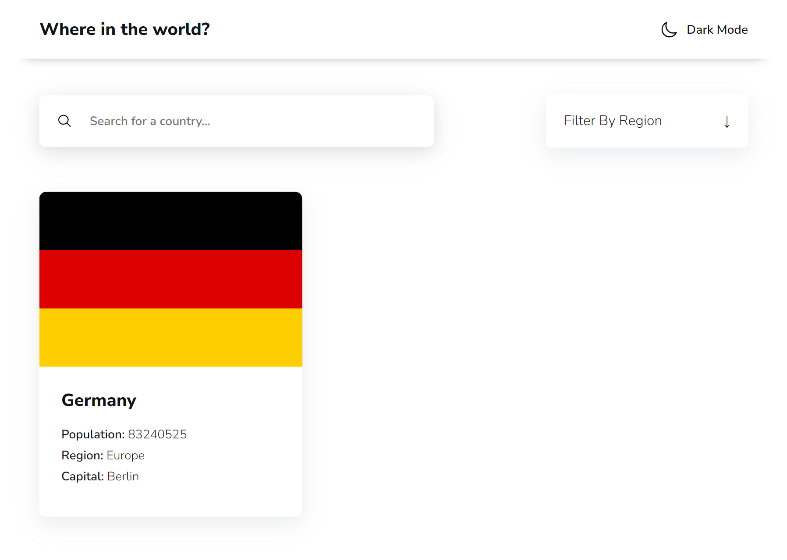

# Frontend Mentor - REST Countries API with color theme switcher solution

This is a solution to the [REST Countries API with color theme switcher challenge on Frontend Mentor](https://www.frontendmentor.io/challenges/rest-countries-api-with-color-theme-switcher-5cacc469fec04111f7b848ca). Frontend Mentor challenges help you improve your coding skills by building realistic projects.

## Table of contents

- [Overview](#overview)
  - [The challenge](#the-challenge)
  - [Screenshot](#screenshot)
  - [Links](#links)
- [My process](#my-process)
  - [Built with](#built-with)
  - [What I learned](#what-i-learned)
  - [Continued development](#continued-development)
  - [Useful resources](#useful-resources)
- [Author](#author)

**Note: Delete this note and update the table of contents based on what sections you keep.**

## Overview

### The challenge

Users should be able to:

- See all countries from the API on the homepage
- Search for a country using an `input` field
- Filter countries by region
- Click on a country to see more detailed information on a separate page
- Click through to the border countries on the detail page
- Toggle the color scheme between light and dark mode _(optional)_

### Screenshot



### Links

- Solution URL: [Live Preview](https://rest-countries-api-fem-two.vercel.app/)
- Live Site URL: [Github Code](https://github.com/AmanGupta1703/REST-Countries-API-FEM/tree/main)

## My process

### Built with

- Semantic HTML5 markup
- CSS custom properties
- Flexbox
- CSS Grid

### What I learned

```html
        <section class="selector selector--region">
          <div class="selector__header">
            <div class="selector__trigger">Filter by region</div>
            <span class="selector__icon selector__icon-arrow-down">&darr;</span>
          </div>
          <div class="selector__options selector__options--hide">
            <div class="selector__option" data-region="africa">africa</div>
            <div class="selector__option" data-region="americas">americas</div>
            <div class="selector__option" data-region="asia">asia</div>
            <div class="selector__option" data-region="europe">europe</div>
            <div class="selector__option" data-region="oceania">oceania</div>
            <div class="selector__option" data-region="antarctic">antarctic</div>
          </div>
        </sect
```

```css
.selector {
	color: var(--color-light-mode-01);
	font-size: 1.6rem;
	background-color: var(--color-white);
	border-radius: 0.6rem;
	-webkit-box-shadow: rgba(149, 157, 165, 0.2) 0px 8px 24px;
	box-shadow: rgba(149, 157, 165, 0.2) 0px 8px 24px;
	-webkit-transition: all 0.5s ease;
	transition: all 0.5s ease;
	position: relative;
}
@media screen and (max-width: 730px) {
	.selector {
		max-width: 25rem;
	}
}
.selector:hover {
	-webkit-box-shadow: rgba(149, 157, 165, 0.2) 0px 4px 12px;
	box-shadow: rgba(149, 157, 165, 0.2) 0px 4px 12px;
}
.selector__header {
	cursor: pointer;
	display: -webkit-box;
	display: -ms-flexbox;
	display: flex;
	-webkit-box-align: center;
	-ms-flex-align: center;
	align-items: center;
	-webkit-box-pack: justify;
	-ms-flex-pack: justify;
	justify-content: space-between;
	padding: 2rem;
	width: 23rem;
}
.selector__trigger {
	text-transform: capitalize;
}
.selector__icon {
	-webkit-transition: all 0.5s ease;
	transition: all 0.5s ease;
}
.selector__icon--active {
	-webkit-transform: rotate(180deg);
	transform: rotate(180deg);
}
.selector__options {
	background-color: var(--color-white);
	-webkit-box-shadow: rgba(149, 157, 165, 0.2) 0px 8px 24px;
	box-shadow: rgba(149, 157, 165, 0.2) 0px 8px 24px;
	border-radius: 0.6rem;
	font-size: 1.4rem;
	padding: 2rem;
	-webkit-transition: 0.5s all ease;
	transition: 0.5s all ease;
	position: absolute;
	left: 0;
	width: 100%;
}
.selector__options--hide {
	top: 0;
	visibility: hidden;
	opacity: 0;
	z-index: -1;
}
.selector__options--show {
	top: 110%;
	visibility: visible;
	opacity: 1;
	z-index: 2;
}
.selector__option {
	cursor: pointer;
	text-transform: capitalize;
	margin-bottom: 1rem;
}
```

```js
function setupCountrySearchForm() {
	const formSearchCountryEl = document.querySelector(".form--search-country");

	formSearchCountryEl.addEventListener("submit", function (e) {
		e.preventDefault();

		const countryToSearch = formSearchCountryEl.countryName.value;

		if (!countryToSearch) {
			return;
		}

		searchCountry(data, countryToSearch).then((data) => {
			render(countryListContainerEl, data);
		});

		formSearchCountryEl.reset();
	});
}

function setupRegionSelector() {
	const selectorHeaderEl = document.querySelector(".selector__header");
	const selectorTriggerEl = document.querySelector(".selector__trigger");
	const selectorIconEl = document.querySelector(".selector__icon");
	const selectorOptionsEl = document.querySelector(".selector__options");

	selectorHeaderEl.addEventListener("click", function () {
		selectorOptionsEl.classList.toggle("selector__options--hide");
		selectorOptionsEl.classList.toggle("selector__options--show");

		selectorIconEl.classList.toggle("selector__icon--active");
	});

	selectorOptionsEl.addEventListener("click", function (e) {
		const { region } = e.target.dataset;

		selectorTriggerEl.textContent = region;

		filterByRegion(data, region).then((data) => {
			if (!data.length) {
				console.log(0);

				countryListContainerEl.textContent =
					"<p>No countries found for this region</p>";
			}
			console.log(data);
			render(countryListContainerEl, data);
		});
	});
}
```

### Continued development

- Responsive Development
- SASS

### Useful resources

- [Example resource 1](https://www.example.com)

## Author

- Website - [REST Country API](https://rest-countries-api-fem-two.vercel.app/)
- Frontend Mentor - [@AmanGupta1703](https://www.frontendmentor.io/profile/AmanGupta1703)
- Twitter - [@thekunalgupta17](https://www.twitter.com/thekunalgupta17)
